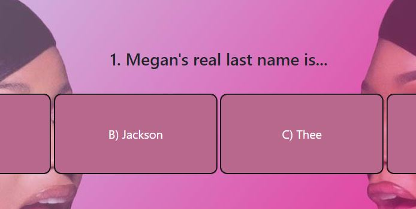
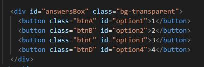
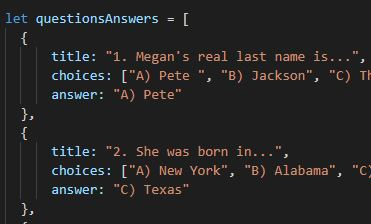

# Code-Quiz

A multiple choice timed quiz engine with interactive features. It utilizes the Bootstrap grid system, incorporates accessibility standards, and is built to reduce media queries.

  

## Table of Contents

* [Tech Used](#tech_used)
* [Usage](#usage)
* [Features](#features)
* [Deployed_Link](#deployed_link)
* [Author](#author)
* [Credits](#credits)
* [License](#license)

----

## Tech Used

* [HTML](https://developer.mozilla.org/en-US/docs/Web/HTML)
* [Bootstrap](https://getbootstrap.com/)
* [Javascript](https://developer.mozilla.org/en-US/docs/Web/JavaScript)

## Usage
 
 This multiple choice timed quiz engine with interactive features. It utilizes the Bootstrap grid system, incorporates accessibility standards, and is built to reduce media queries.

## Features

- Functional Start button and Countdown timer.

- Active event listeners on answer buttons.
  

- And action buttons arranged in a box container...
  

- Questions and Answers formatted together as an object.

  

- A single submit button that stores player initials and hi-score!
  

## Deployed Link

* [See Live Site](https://ajhuff7.github.io/Code-Quiz/)

---

## Author

**AJ Huff** 

- [Portfolio Site](#)
- [Github](https://github.com/ajhuff7)
- [LinkedIn](https://www.linkedin.com/in/aj-huff-7696b14b/)

## Credits

**Huge appreciation to the folks that got me "unstuck"!

## License

 

